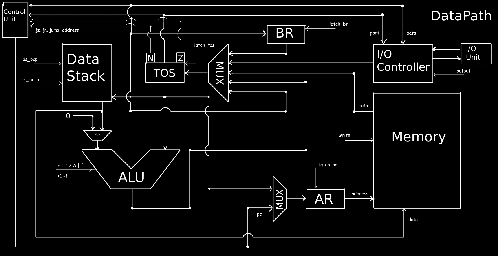
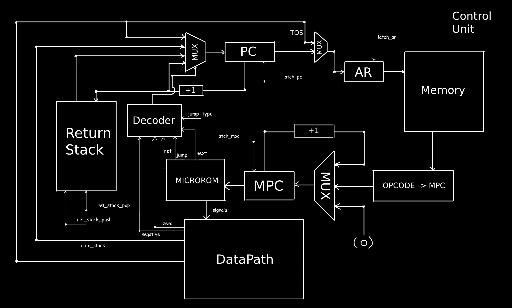

<!-- markdownlint-disable MD013 -->

# Computer Systems and Architecture Labwork №4

**Выполнил:** Тимошкин Роман Вячеславович, группа P3231

**Вариант:** `asm | stack | neum | mc | tick | binary | stream | port | pstr | prob1 | -`

## Содержание

- [Язык программирования](#язык-программирования)
- [Организация памяти](#организация-памяти)
- [Система команд](#система-команд)
- [Транслятор](#транслятор)
- [Модель процессора](#модель-процессора)
- [Тестирование](#тестирование)

## Язык программирования

### Синтаксис

Синтаксис языка описан в форме Бэкуса-Наура:

```ebnf
<program> ::= <line>*

<line> ::= <label> <comment>? "\n"
       | <instr> <comment>? "\n" 
       | <comment> "\n"
       | <section_decl> "\n"
       | <org_directive> "\n"
       | <macro_definition> "\n"
       | <macro_call> <comment>? "\n"

<section_decl> ::= ".data" | ".text"

<org_directive> ::= ".org" " " <positive_integer>

<macro_definition> ::= ".macro" " " <macro_name> <macro_params>? "\n" <macro_body> ".endmacro"

<macro_params> ::= " " <macro_param> (" " <macro_param>)*

<macro_param> ::= <label_name>

<macro_body> ::= <line>*

<macro_call> ::= <macro_name> <macro_args>?

<macro_args> ::= " " <operand> (" " <operand>)*

<label> ::= <label_name> ":"

<instr> ::= <op0>
        | <op1> " " <operand>
        | <string_decl>

<op0> ::= "nop" | "load" | "store" | "add" | "sub" | "mul" | "div" | "mod"
      | "inc" | "dec" | "drop" | "dup" | "swap" | "over" 
      | "and" | "or" | "xor" | "jz" | "jn" | "jump" | "call" | "ret"
      | "in" | "out" | "halt"

<op1> ::= "lit" | "word" | "buf"

<operand> ::= <label_name> | <positive_integer>

<string_decl> ::= "string" " " '"' <string_content> '"'

<string_content> ::= <visible_char>*

<positive_integer> ::= [0-9]+
<integer> ::= "-"? <positive_integer>

<label_name> ::= <letter> <letter_or_number_or_underscore>*
<macro_name> ::= <letter> <letter_or_number_or_underscore>*

<letter> ::= [a-zA-Z]
<letter_or_number_or_underscore> ::= <letter> | [0-9] | "_"
<visible_char> ::= любой печатный символ ASCII кроме '"'

<comment> ::= ";" <comment_content>
<comment_content> ::= любые символы до конца строки
```

### Семантика

**Стратегия вычислений:**

- Стековая архитектура с двумя стеками: стек данных и стек возвратов
- Прямой порядок вычислений (eager evaluation)
- Инструкции выполняются последовательно, одна за другой

**Области видимости:**

- Глобальная область видимости для всех меток
- Метки видны во всей программе и могут использоваться для переходов и вызовов процедур
- Переменные размещаются в глобальной памяти

**Типизация:**

- Слабая типизация
- Единственный тип данных - 32-битное целое число со знаком
- Литералы: целые числа (например, `42`, `-17`)
- Строковые литералы представляются как Pascal-строки (длина + содержимое)

**Управление потоком выполнения:**

- Безусловные переходы: `jump`
- Условные переходы: `jz` (переход при нуле), `jn` (переход при отрицательном значении)
- Вызов процедур: `call` с возвратом через `ret`
- Остановка программы: `halt`

**Директивы ассемблера:**

- `.org <address>` - установка текущего адреса размещения кода/данных
- `.macro <name> [params]` ... `.endmacro` - определение макроса с параметрами
- Вызов макроса с передачей аргументов для подстановки параметров

**Пример программы (вычисление факториала):**

```asm
.data
res:
        word 0      ; результат вычисления

.text
fac:
        dup         ; Stack: arg arg
        lit 1       ; Stack: arg arg 1
        sub         ; Stack: arg (arg-1)
        lit break   ; Stack: arg (arg-1) break
        swap        ; Stack: arg break (arg-1)
        jz          ; Stack: arg (если arg-1 == 0, переход на break)
        dup         ; Stack: arg arg
        dec         ; Stack: arg (arg-1)
        lit fac     ; Stack: arg (arg-1) fac
        call        ; Stack: arg result
        mul         ; Stack: result
break:
        ret         ; Stack: arg/result

start:
        lit 11      ; Stack: 11
        lit fac     ; Stack: 11 fac
        call        ; Stack: 11!
        lit res     ; Stack: 11! res_addr
        store       ; Stack: <empty>
        halt        ; остановка программы
```

## Организация памяти

### Модель памяти процессора

Процессор имеет фон-неймановскую архитектуру с единым пространством памяти для команд и данных:

- **Размер машинного слова:** 32 бита
- **Адресация:** прямая через стек данных
- **Порядок байтов:** little-endian

```text
           Стеки
+------------------------------+
| Data Stack (стек данных)     |
| Return Stack (стек возвратов)|
+------------------------------+

    Единая память (Memory)
+------------------------------+
| 00  : program start          |
| 01  : instruction 1          |
| 02  : instruction 2          |
| ... : ...                    |
| n   : variable 1             |
| n+1 : variable 2             |
| ... : ...                    |
| k   : Pascal string length   |
| k+1 : string char 1          |
| k+2 : string char 2          |
| ... : ...                    |
| m   : buffer space           |
| ... : ...                    |
+------------------------------+
```

### Управление памятью

**Литералы:**

- Небольшие целочисленные литералы (помещающиеся в операнд инструкции) используют непосредственную адресацию
- Большие литералы и строки сохраняются в статическую память данных
- Расположение в памяти: последовательно в порядке объявления

**Константы и переменные:**

- Все переменные размещаются в статической памяти данных
- Инициализация происходит на этапе трансляции
- Доступ через инструкции `load`/`store` с адресацией через стек данных

**Строки:**

- Представлены как Pascal-строки: первый байт содержит длину, далее следуют символы
- Размещаются в статической памяти последовательно

**Инструкции:**

- Хранятся в единой памяти
- Выполняются последовательно, начиная с адреса метки `start`
- Переходы изменяют адрес следующей выполняемой инструкции

**Процедуры:**

- Адрес возврата сохраняется в стек возвратов
- Параметры передаются через стек данных
- Локальные переменные не поддерживаются (только глобальные)

**Стеки:**

- Стек данных: хранит операнды и промежуточные результаты вычислений
- Стек возвратов: хранит адреса возврата из процедур  
- Реализованы как отдельные структуры данных, не связанные с основной памятью

## Система команд

### Особенности процессора

**Архитектура:** Стековая машина (Stack-based) с микропрограммным управлением

**Типы данных:**

- 32-битные целые числа со знаком
- Pascal-строки (длина + символы)

**Устройство памяти и регистров:**

- Фон-неймановская архитектура (единая память для команд и данных)
- Стековая архитектура без регистров общего назначения
- Два стека: стек данных и стек возвратов
- Размер машинного слова: 32 бита

**Устройство ввода-вывода:**

- Портовый ввод-вывод
- Буферизованный поток данных
- Инструкции `in`/`out` для взаимодействия с внешними устройствами

**Поток управления:**

- Последовательное выполнение инструкций
- Условные и безусловные переходы
- Вызовы процедур с использованием стека возвратов
- Микропрограммное управление с тактовой синхронизацией

### Набор инструкций

**Инструкции управления данными:**

- `NOP` - нет операции (1 такт)
- `LIT <operand>` - поместить литерал на стек (2 такта)
- `LOAD` - загрузить значение из памяти по адресу TOS (3 такта)
- `STORE` - сохранить значение в память (3 такта)

**Арифметические операции:**

- `ADD` - сложение двух верхних элементов стека (2 такта)
- `SUB` - вычитание (2 такта)
- `MUL` - умножение (2 такта)  
- `DIV` - деление (2 такта)
- `MOD` - остаток от деления (2 такта)
- `INC` - инкремент TOS (1 такт)
- `DEC` - декремент TOS (1 такт)

**Операции со стеком:**

- `DROP` - удалить TOS (1 такт)
- `DUP` - дублировать TOS (2 такта)
- `SWAP` - поменять местами два верхних элемента (2 такта)
- `OVER` - скопировать предпоследний элемент наверх (2 такта)

**Логические операции:**

- `AND` - побитовое И (2 такта)
- `OR` - побитовое ИЛИ (2 такта)
- `XOR` - побитовое исключающее ИЛИ (2 такта)

**Операции управления потоком:**

- `JZ` - переход при нуле (2 такта)
- `JN` - переход при отрицательном значении (2 такта)
- `JUMP` - безусловный переход (2 такта)
- `CALL` - вызов процедуры (3 такта)
- `RET` - возврат из процедуры (2 такта)

**Операции ввода-вывода:**

- `IN` - ввод данных из порта (2 такта)
- `OUT` - вывод данных в порт (2 такта)

**Управляющие операции:**

- `HALT` - остановка процессора (1 такт)

**Псевдоинструкции (только для ассемблера):**

- `WORD <value>` - резервирование памяти для переменной
- `BUF <size>` - резервирование буфера заданного размера
- `STRING "<text>"` - объявление Pascal-строки

### Кодирование инструкций

Инструкции кодируются в бинарном формате:

```text
┌─────────────────┬─────────────────┐
│   OPCODE (32)   │   OPERAND (32)  │
└─────────────────┴─────────────────┘
```

- **OPCODE**: код операции
- **OPERAND**: операнд (для инструкций с операндом)

Для инструкций без операнда поле OPERAND не используется.

### Классификация системы команд

Система команд относится к типу **stack** (стековая архитектура):

- Основные вычисления выполняются через стек данных
- Отсутствие явных регистров общего назначения в системе команд

## Транслятор

Транслятор реализован в виде консольного приложения, которое преобразует исходный код на языке ассемблера в машинный код.

### Интерфейс командной строки

```bash
java -jar asm-1.0.jar <input_file> <target_file>
```

**Входные данные:**

- `<input_file>` - имя файла с исходным кодом программы на ассемблере
- `<target_file>` - имя файла для сохранения машинного кода

**Выходные данные:**

- Файл с машинным кодом в бинарном формате
- Сообщения об ошибках трансляции (если есть)

### Принципы работы транслятора

Транслятор работает в **два прохода**:

**Первый проход:**

1. Лексический анализ исходного кода
2. Синтаксический анализ инструкций
3. Построение таблицы меток и вычисление их адресов
4. Генерация предварительного машинного кода без разрешения ссылок на метки
5. Обработка псевдоинструкций (`WORD`, `BUF`, `STRING`)

**Второй проход:**

1. Разрешение ссылок на метки
2. Подстановка адресов меток в инструкции переходов и вызовов
3. Финальная генерация машинного кода

**Особенности трансляции:**

- Мнемоники ассемблера транслируются один-к-одному в машинные инструкции
- Псевдоинструкции `WORD`, `BUF`, `STRING` создают данные в памяти без генерации opcode
- Поддержка секций `.data` и `.text` для разделения данных и кода
- Проверка корректности синтаксиса и семантики на этапе трансляции

**Обработка ошибок:**

- Синтаксические ошибки: неправильная структура инструкций
- Семантические ошибки: неопределенные метки, некорректные операнды
- Выдача подробных сообщений с указанием номера строки и типа ошибки

## Модель процессора

Модель процессора реализована в виде консольного приложения, симулирующего выполнение машинного кода.

### Интерфейс командной строки процессора

```bash
java -jar comp-1.0.jar -p <target_file> -i <input_stream> -o <output_stream> -l <log_stream>
```

**Входные данные:**

- `-p <target_file>` - имя файла с машинным кодом для выполнения
- `-i <input_stream>` - имя файла с данными для имитации ввода
- `-o <output_stream>` - имя файла для записи вывода программы (необязательно)
- `-l <log_stream>` - имя файла для записи журнала выполнения (необязательно)

**Выходные данные:**

- Результат выполнения программы
- Подробный журнал состояний процессора после каждой микроинструкции
- Дамп памяти после завершения выполнения

### Схемы DataPath и ControlUnit




### Особенности реализации моделирования

**Тактовая синхронизация:**

- Каждая инструкция выполняется за определенное количество тактов
- Микропрограммное управление с пошаговым выполнением микроинструкций
- Журналирование состояния после каждого такта

**Управление потоком данных:**

- Сигнальная модель с явным управлением всеми элементами
- Синхронная работа всех компонентов процессора
- Точное моделирование аппаратного поведения

**Обработка прерываний:**

- Остановка процессора по инструкции `HALT`
- Контроль переполнения стеков
- Обработка исключительных ситуаций (деление на ноль и т.п.)

**Журналирование:**

- Состояние всех регистров после каждой микроинструкции
- Содержимое стеков данных и возвратов
- Операции с памятью (чтение/запись)
- Операции ввода-вывода
- Выполняемые инструкции с соответствующим исходным кодом
- Значение программного счетчика

## Тестирование

### Описание тестов

Разработан набор golden тестов, покрывающий основные алгоритмы и особенности системы команд. Тесты включают проверку корректности трансляции, выполнения программ и соответствия выходных данных эталонным значениям.

### Запуск тестов

```bash
cd python
poetry run pytest . -v
```

### Golden тесты алгоритмов

**Обязательные алгоритмы:**

1. **`hello`** - вывод строки "Hello, world!"
   - [Исходный код и тест](/python/golden/hello.yml)
   - Демонстрирует работу с Pascal-строками и вывод

2. **`cat`** - копирование ввода в вывод
   - [Исходный код и тест](/python/golden/cat.yml)  
   - Демонстрирует потоковый ввод-вывод с неограниченным размером данных

3. **`hello_username`** - интерактивное приветствие пользователя
   - [Исходный код и тест](/python/golden/hello_username.yml)
   - Пример взаимодействия:

     ```text
     > What is your name?  
     < Alice
     > Hello, Alice!
     ```

4. **`wide`** - широкая арифметика
   - [Исходный код и тест](/python/golden/wide.yml)
   - работа с двойной точностью (64-бит на 32-битной архитектуре)

5. **`prob1`** - алгоритм согласно варианту
   - [Исходный код и тест](/python/golden/prob1.yml)
   - Решение задачи Project Euler #1
   - Тест отключен в CI из-за долгого времени выполнения

6. **Дополнительные алгоритмы:**
   - **`fac`** - вычисление факториала (демонстрация рекурсии)
   - **`macros`** - использование макросов и сложных конструкций

### Структура golden тестов

Каждый тест включает:

- **Исходный код** программы на ассемблере
- **Машинный код** после трансляции  
- **Входные данные** для программы (если требуются)
- **Ожидаемый вывод** программы
- **Журнал выполнения** с состояниями процессора (сокращенный для читаемости)
- **Дамп памяти** после завершения программы

### Пример использования

**Трансляция программы:**

```bash
java -jar asm-1.0.jar examples/hello.asm hello.bin
```

**Выполнение программы:**

```bash  
java -jar comp-1.0.jar -p hello.bin -i input.txt -o output.txt -l execution.log
```

**Результат выполнения:**

- `output.txt` - результат работы программы
- `execution.log` - подробный журнал выполнения
- Отображение финального состояния процессора и памяти

Все тесты проходят автоматическую проверку через систему continuous integration с использованием Python и pytest.
